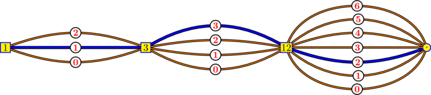

```{r setup, include=FALSE, purl=FALSE}
library(expansions)
knitr::opts_chunk$set(echo = TRUE, collapse=TRUE)
```


# Expansions of integers

## Conversion of decimal integers to integer base

This is the role of the `intAtBase` function:

```{r}
intAtBase(32, base=3)
```

This result means that
$$
32 = \color{red}{2} \times 1 + \color{red}{1} \times 3^1 + \color{red}{0} \times 3^2 + \color{red}{1} \times 3^3
$$

```{r}
2*1 + 1*3 + 0*3^2 + 1*3^3
```


The `intAtBasePower` function returns the expansion of the integer $m^p$ where $m$ and $p$ are supplied by the user:

```{r}
intAtBasePower(2, 5, base=3)
intAtBase(2^5, base=3)
```

The advantage is the possibility to convert huge numbers $m^p$:

```{r, error=TRUE}
# 2^100 is too big for intAtBase:
intAtBase(2^100, base=3)
# then use intAtBasePower:
( digits <- intAtBasePower(2, 100, base=3) )
sum(digits * 3^(seq_along(digits)-1)) == 2^100
```

The `intAtBaseFib` function returns the expansion of a Fibonacci number given by its index. For example, the $6$-th Fibonacci number is $8$:

```{r}
intAtBaseFib(6, base=3)
intAtBase(8, base=3)
```

The $50$-th Fibonacci number is $12586269025$:

```{r}
digits <- intAtBaseFib(50, base=3)
sum(digits * 3^(seq_along(digits)-1))
```


## Cantor expansions, or "ary" expansions 

The `intToAry` function performs the [Cantor expansion](http://stla.github.io/stlapblog/posts/Greedy.html) of an integer. 

For example, the $(3,4,7)$-ary expansion of $34$: 

```{r}
intToAry(34, sizes=c(3,4,7))
```

This means that
$$
34 = \color{red}{1} \times 1 + \color{red}{3} \times 3 + \color{red}{2} \times (3 \times 4).
$$

```{r}
1*1 + 3*3 + 2*(3*4)
```

Each $(3,4,7)$-ary expansion of an integer corresponds to a path on the following graph:



There are $84$ paths on the above graph. That means that the $(3,4,7)$-ary expansion 
is possible for integers from $0$ to $83$.

The last integer of the `sizes` vector is not seemingly involved in the development $d_1 \times 1 + d_2 \times 3 + d_3 \times (3 \times 4)$. 
Actually it is: the digits satisfy $d_1 < 3$, $d_2 < 4$ and $d_3 < 7$. 
Thus, indeed, the maximal integer allowing a $(3,4,7)$-ary expansion is $\color{red}{2}\times 1 +\color{red}{3}\times 3+\color{red}{6}\times(3\times 4)=83$:

```{r, error=TRUE}
intToAry(83, sizes=c(3,4,7))
intToAry(84, sizes=c(3,4,7))
```


As an illustration, the `intToAry` function allows to get a Cartesian product of sets:

```{r}
# Cartesian product {0,1,2}x{0,1,2,3}:
sapply(0:11, function(x) intToAry(x, sizes=c(3,4)))
t(expand.grid(c(0,1,2), c(0,1,2,3)))
```

This function is implemented with `Rcpp` ([source code](https://github.com/stla/expansions/blob/master/src/rcpp_intToAry.cpp)), and it is fast. 

It can be applied to [avoid nested loops](http://stla.github.io/stlapblog/posts/Greedy.html). 


# Float expansions

## Expand a number between $0$ and $1$

The `floatExpand01` function returns the expansion of a real number between $0$ and $1$  in a given integer base. For example:

```{r}
floatExpand01(0.625, base=2)
```

It means that $0.625 =\color{red}{1} \times \frac{1}{2} + \color{red}{0} \times \frac{1}{2^2} + \color{red}{1} \times \frac{1}{2^3}$.

## Expansion of a positive number

The `floatExpand` function returns a list representing the expansion of a positive number in scientific notation:
$$
x = 0.d_1d_2\ldots d_n \times \text{base}^e.
$$
The digits $d_1$, $\ldots$, $d_n$ are given in the first component of the list and the exponent $e$ is given in the second one.

For example:

```{r}
floatExpand(1.125, base=2)
# check:
1.125 == (1*1/2 + 0*1/2^2 + 0*1/2^3 + 1*1/2^4) * 2^1
```


# Odometers and addition of adic integers

The odometer is the action $x \mapsto x+1$ on the group of $b$-adic integers. 
In other words, $x$ is the expansion in an integer base $b$ of a real number between $0$ and $1$, and the odometer maps $x$ to $x + (1, 0, 0, \ldots)$ where "$+$" is the addition modulo $b$ with carry to the right. 

```{r}
odometer(c(1,0,1), base=2)
```

By transporting the $3$-adic integers to $[0,1)$ with the float expansion in base $3$, let's have a look at the graph of the $3$-adic odometer:

```{r odometer, fig.width=5, fig.height=5, fig.align='center', fig.show='hold'}
ternary2num <- function(t) sum(t/3^seq_along(t))
num2ternary <- function(u) floatExpand01(u, base=3)
par(mar=c(4,4,2,2))
u <- seq(0, 0.995, by=0.0025)
Ou <- sapply(u, function(u) ternary2num(odometer(num2ternary(u), base=3)))
plot(u, Ou, xlab="u", ylab="O(u)", xlim=c(0,1), ylim=c(0,1),
     pch=19, cex=.25, pty="s", xaxs="i", yaxs="i")
grid(nx=9)
```

The `expansions` package also provides the function `sumadic` to perform the sum of two adic integers:

```{r}
sumadic(c(0,1), c(1,1,1), base=2)
identical(sumadic(c(0,1), 1, base=2), odometer(c(0,1), base=2))
```

The function `odometer_iterated` iterates the `odometer` function:

```{r}
d <- c(1,0,2)
b <- 3
identical(odometer(odometer(d, base=b), base=b), odometer_iterated(d, n=2, base=b))
```

Note these two ways to get the same result:

```{r}
n <- 13
odometer_iterated(d, n=n, base=b)
sumadic(d, intAtBase(n, base=b), base=b)
```

The second one is faster:

```{r}
n <- 2000000
system.time(odometer_iterated(d, n=n, base=b))
system.time(sumadic(d, intAtBase(n, base=b), base=b))
```


```{r, purl=FALSE, include=FALSE}
knitr::knit_exit()
```


Vignettes are long form documentation commonly included in packages. Because they are part of the distribution of the package, they need to be as compact as possible. The `html_vignette` output type provides a custom style sheet (and tweaks some options) to ensure that the resulting html is as small as possible. The `html_vignette` format:

- Never uses retina figures
- Has a smaller default figure size
- Uses a custom CSS stylesheet instead of the default Twitter Bootstrap style

## Vignette Info

Note the various macros within the `vignette` section of the metadata block above. These are required in order to instruct R how to build the vignette. Note that you should change the `title` field and the `\VignetteIndexEntry` to match the title of your vignette.

## Styles

The `html_vignette` template includes a basic CSS theme. To override this theme you can specify your own CSS in the document metadata as follows:

    output: 
      rmarkdown::html_vignette:
        css: mystyles.css

## Figures

The figure sizes have been customised so that you can easily put two images side-by-side. 

```{r, fig.show='hold'}
plot(1:10)
plot(10:1)
```

You can enable figure captions by `fig_caption: yes` in YAML:

    output:
      rmarkdown::html_vignette:
        fig_caption: yes

Then you can use the chunk option `fig.cap = "Your figure caption."` in **knitr**.

## More Examples

You can write math expressions, e.g. $Y = X\beta + \epsilon$, footnotes^[A footnote here.], and tables, e.g. using `knitr::kable()`.

```{r, echo=FALSE, results='asis'}
knitr::kable(head(mtcars, 10))
```

Also a quote using `>`:

> "He who gives up [code] safety for [code] speed deserves neither."
([via](https://twitter.com/hadleywickham/status/504368538874703872))
